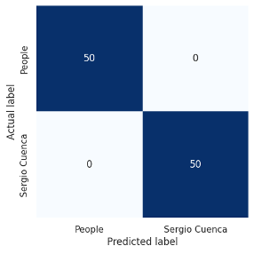

# Identity Verification in Moodle through Facial Recognition based on Deep Learning

  

## Description

This project aims to develop a **facial recognition**-based **identity verification** system for accessing the **Moodle** learning platform. It uses **convolutional neural networks** and **transfer learning** techniques to improve recognition accuracy and ensure academic integrity in remote exams and other sensitive activities within the platform.

## Features

- **Facial Recognition**: Based on convolutional neural network models.
- **Enhanced Security**: Implements two-factor authentication using facial recognition as a complement to the classic username and password authentication.
- **Privacy and Confidentiality**: Ensures data protection through encrypted cookies in the browser.
- **Moodle Plugin**: Facilitates the integration of the facial recognition system into the Moodle platform.

## Prerequisites

- Python 3.x
- Facial recognition library (`face_recognition`)
- Deep learning library (`tensorflow` or `keras`)
- Moodle installed and configured (minimum version 3.5)
- Docker server to run the plugin and API model

## Usage

### Access Moodle

1. Users enter their username and password on the Moodle login page.
2. The system prompts for a facial image capture, which is sent to the API server for verification.
3. If the facial image matches the user's identity, access is granted.

## Results

The system has demonstrated **100% accuracy** on test data thanks to the **transfer learning** technique employed. This ensures **security** and **confidentiality** when accessing the Moodle university platform.

  

## License

This project is licensed under the **Apache License 2.0**. See the [LICENSE](LICENSE) file for more details.
